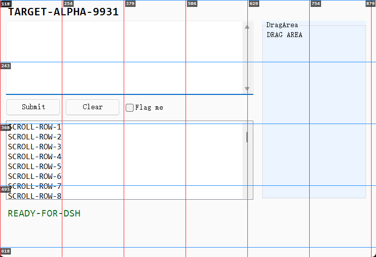

# dsh-ui · 给 AI agent 的跨平台 GUI 操作原语

[](https://github.com/rayadesune/DSH-computer-use/actions/workflows/ci.yml)
[](LICENSE)
[](#两个平台同一套命令面)
[](https://swift.org)
[](docs/REFERENCE-WINDOWS.md)

**看得见、点得准、能验证** —— 让 agent 用真实 HID 事件操作桌面。

`dsh-ui` 有两个实现：macOS 是**单文件 Swift CLI**（`dsh-ui.swift`，注入 `CGEvent`），
Windows 是**单文件 PowerShell CLI**（`dsh-ui.ps1`，注入 `SendInput`）。两者命令面一致，
都能操作无障碍树覆盖不到的地方：Chromium/CEF 内嵌页面、Electron 应用、canvas、游戏。
每个命令都自带**坐标映射、审计日志和干跑模式**，并各配一份写给 agent 的操作规范
（[`skill/SKILL.md`](skill/SKILL.md)、[`skill-win/SKILL.md`](skill-win/SKILL.md)）。



> 上图由本仓库自带测试靶生成：`shot --grid 100` 把**全局坐标数字画进图里**，
> 量小图标时不用再目测缩放预览图。

无第三方依赖、不联网、无遥测 —— 两个实现都只用系统自带 API。

---

## 为什么需要它

让 agent 操作 GUI，难点从来不是"点一下"，而是三件事：

| 难点 | `dsh-ui` 的做法 |
| --- | --- |
| **看不见**：截图坐标和点击坐标对不上，多屏更是灾难 | 每次 `shot` 都打印 `global = origin + px` 映射；`displays` 给出两套坐标对照；`--grid` 直接把**全局坐标数字画在图上**；`--zoom` 无插值放大到能逐像素数 |
| **点不准**：小图标认不出，窗口层级和截图不一致 | OCR 与无障碍树**双通道定位**；`under X Y` 兜底；`--edge-guard` 防误触窗口缩放；点击前自动补齐前台状态（macOS 的"第一击被吃掉"、Windows 的焦点异步切换） |
| **验不了**：点完不知道有没有生效 | `wait-for --text/--stable/--change` 取代固定 `sleep`；`diff` 量化变化并给出变化区域；`--json` 让上层脚本直接判断 |

## 两个平台，同一套命令面

| 能力 | macOS | Windows |
| --- | --- | --- |
| 事件注入 | `CGEvent`（真实 HID） | `SendInput`（真实 HID） |
| 截图 | `screencapture` + GDI 无插值放大 / 网格标尺 | GDI `CopyFromScreen`（1:1 物理像素）+ 同一套标尺与放大 |
| 无障碍树 | Accessibility (AX) | UI Automation (UIA) |
| 文字定位 | Vision OCR（带置信度） | `Windows.Media.Ocr`（**无置信度**，中文识别偏弱，见限制） |
| 窗口管理 | `NSWorkspace` + AX | `EnumWindows` + `SetWindowPos` |
| 状态目录 | `~/.local/state/dsh-ui` | `%LOCALAPPDATA%\dsh-ui` |
| 实现文件 | [`dsh-ui.swift`](dsh-ui.swift) | [`dsh-ui.ps1`](dsh-ui.ps1) + [`dsh-ui.cmd`](dsh-ui.cmd) |

命令名、参数、输出格式、退出码都对齐，差异只在平台行为本身（手册里逐条列了
[Windows 版与 macOS 版的差异](docs/REFERENCE-WINDOWS.md)）。

## 快速开始

### macOS

```sh
git clone https://github.com/rayadesune/DSH-computer-use.git && cd DSH-computer-use
./install.sh                      # 编译并安装到 ~/.local/bin/dsh-ui
dsh-ui displays                   # 屏幕几何：点任何坐标前先读这个
dsh-ui shot -R 0,0,600,360 --grid 50 --zoom 2   # 带全局坐标标尺的局部放大图
dsh-ui find-text "保存" --click    # OCR 找到并点击
dsh-ui --dry click 100 200        # 只打印、不执行
```

需要 macOS 13+、Xcode Command Line Tools，并把**辅助功能**与**屏幕录制**授予运行 agent 的宿主
（通常是 Terminal.app / iTerm）。

### Windows

```powershell
git clone https://github.com/rayadesune/DSH-computer-use.git; cd DSH-computer-use
# 装到 %USERPROFILE%\.local\bin（对应 macOS 的 ~/.local/bin），并装全局 skill
powershell -NoProfile -ExecutionPolicy Bypass -File .\install.ps1 -Prefix "$env:USERPROFILE\.local" -WithSkill
dsh-ui displays
dsh-ui shot -R 0,0,600,400 --grid 50 --zoom 2
dsh-ui find-ax "保存" --app 记事本 --click
dsh-ui --dry click 100 200
```

需要 Windows 10/11 自带的 Windows PowerShell 5.1 或 PowerShell 7.x（**5.1 快约一倍**：
实测 `find-text` 941ms vs 1798ms）。不需要管理员权限，也没有 macOS 那类权限授予 —— Windows
换成两件别的事：工具自己设 PerMonitorV2 DPI 感知（坐标一律物理像素），而提权窗口会忽略合成输入。

## 命令面

| 分类 | 命令 |
| --- | --- |
| 鼠标 | `move` `click` `tap` `press` `dclick` `rclick` `drag` `scroll` |
| 键盘 | `type`（Unicode/中文，绕过输入法） `keys`（真实键码） `key`（含修饰键与方向键 `key down`） |
| 截图 | `shot`（`-D/-R/-C/-c/-o/--grid/--zoom`） `displays` |
| 定位 | `find-text`（OCR，`--all/--fast/--click/--list/--json`） `find-ax`（无障碍树，`--app/--pid/--all`） `under` `foreground`（当前谁占着前台） |
| 窗口 | `win list \| focus \| maximize \| fullscreen \| move`（Windows 另有 `close/minimize/restore`） |
| 菜单 | `menu --list X Y` / `menu X Y "项1/项2"` / `menu --close`（Windows：右键后用方向键导航，不点菜单项） |
| 验证 | `wait-for --text/--stable/--change` `diff` |
| 其他 | `clipboard` `batch` `guard` `pos` `--dry` |

退出码：`0` 成功 / `1` 未命中、超时，或**目标窗口不在前台因此拒绝发送点击** / `2` 用法错误 / `3` 被拦截名单拒绝。

完整手册：[docs/REFERENCE.md](docs/REFERENCE.md)（macOS）、
[docs/REFERENCE-WINDOWS.md](docs/REFERENCE-WINDOWS.md)（Windows，含实测数据与与 macOS 的差异）。

## 安全机制

| 机制 | 说明 |
| --- | --- |
| 审计日志 | 每条命令留痕（时间、参数、退出码），问"刚才做了什么"时有据可查 |
| 拦截名单 | 命中密码管理器等敏感应用则拒绝执行并返回 exit `3`（Windows 版默认写入一份名单，鼠标与键盘两条路径都拦） |
| 干跑模式 | `--dry` 只打印将要执行的动作；注意它**只挡副作用、不挡读取**（OCR/截图仍会真的发生，与 macOS 版一致） |
| 无审批门 | 工具会立即执行。发送消息、提交表单、购买、改账号安全设置、删数据之前，请先向用户确认 |

## 验证到什么程度

这个仓库的立场是：**"没有报错" ≠ "成功了"**。所以两套实现都带可复现的验证，而不是只有 demo。

- **Windows：54 项自动化断言**（[`tests/verify-windows.ps1`](tests/verify-windows.ps1)）
  在真实桌面上跑，PowerShell 7 与 Windows PowerShell 5.1 **各跑一遍**。断言不解析输出文本，
  而是回到**受控测试靶**（[`tests/ui-target.ps1`](tests/ui-target.ps1)，一个自建 WinForms 窗口）
  自己写出的状态取证：点击只有在按钮的处理函数真的触发时才算数，输入必须逐字符相等，
  拖拽必须报出请求的位移，`--dry` 之后状态必须一个字节都没变。
  实测如：OCR 命中的坐标与按钮中心相差 **1px**；`shot -C` 的光标差异正好落在光标处。
- **macOS：CI 在 `macos-14` 上构建 + 冒烟**，并检查 `--help` 覆盖了分发器里实现的每一条命令。
- **Windows 静态检查**：CI 里还有一组不需要桌面的检查（`.ps1` 必带 UTF-8 BOM、
  `.cmd` 必须纯 ASCII、skill frontmatter、`--help` 覆盖率）。
- 全部实测记录（含踩过的坑与**未验证项**）：[docs/VERIFICATION-WINDOWS.md](docs/VERIFICATION-WINDOWS.md)。

复现：

```powershell
# Windows（会短暂弹出一个自建测试窗口，全程只操作它自己）
powershell -NoProfile -ExecutionPolicy Bypass -File tests\verify-windows.ps1 -AlsoPs51
```

## 已知限制

写在前面，省得你踩（完整清单在各自手册的「已知限制」一节）：

- **别用固定 `sleep` 判断成败**。本项目出现过整条管线全绿、产物却只有一帧的情况 ——
  用 `wait-for` 与 `diff` 验证。
- **OCR 不是可靠的唯一通道**。Windows 的中文识别明显弱于 macOS Vision（实测 `无标题` →
  `无 》 玺 题`），且不提供置信度；能走无障碍树就优先 `find-ax`。
- **`find-text` 会读到屏幕上的一切**，包括 agent 自己的对话窗口；`--click` 别指向自己的聊天记录。
- **`under X Y` 可能指错**（重叠窗口），点击要紧时用 `shot`/`win list` 佐证。
- **提权窗口忽略合成输入（UIPI）**；**锁屏状态无效**（预期送不到、截图变黑）；
  **多显示器在 Windows 侧未实测**（macOS 侧已验证）。这三项在文档里都挂了 ⚠。
- 部分应用完全不暴露无障碍树（Steam 实测），此时只能用 OCR 或截图量坐标。

## 文档地图

| 内容 | macOS | Windows |
| --- | --- | --- |
| 完整命令手册 | [docs/REFERENCE.md](docs/REFERENCE.md) | [docs/REFERENCE-WINDOWS.md](docs/REFERENCE-WINDOWS.md) |
| 给 agent 的操作规范 | [skill/SKILL.md](skill/SKILL.md) | [skill-win/SKILL.md](skill-win/SKILL.md) |
| 实测记录 | 见手册「已验证场景」 | [docs/VERIFICATION-WINDOWS.md](docs/VERIFICATION-WINDOWS.md) |
| 自动化验证 | CI（macos-14） | [tests/verify-windows.ps1](tests/verify-windows.ps1) |
| 安装 | `./install.sh` | [`install.ps1`](install.ps1) · [`dsh-ui.cmd`](dsh-ui.cmd) |

## 开发

```sh
make build      # macOS: swiftc -O dsh-ui.swift -o dsh-ui
make test       # 冒烟测试：--help / --dry / keys 映射 / displays
make install    # 安装到 ~/.local/bin
make sync-skill # 把 skill 同步到本机 agent 技能目录
```

```powershell
# Windows
powershell -NoProfile -File tests\sanity-windows.ps1        # 静态检查（任意平台可跑）
powershell -NoProfile -File tests\verify-windows.ps1        # 全量验证（需要桌面）
pwsh -NoProfile -File tests\verify-windows.ps1 -SkipInput   # 跳过真实输入类
```

欢迎提 Issue / PR。三条硬要求：

1. 新命令必须同时更新 `--help` 与对应手册，否则 CI 会挂。
2. 踩到的坑请写进对应 skill 的「Known limitations」—— 这个项目最大的价值就是把
   "看起来能用其实不能用"的边界写清楚。
3. Windows 侧：**`.ps1` 必须 UTF-8 with BOM**（无 BOM 时 Windows PowerShell 5.1 会按系统
   ANSI 代码页解码，中文注释吃掉花括号导致解析失败），**`.cmd` 必须纯 ASCII**。
   `tests/sanity-windows.ps1` 会检查这两条。

## License

[MIT](LICENSE)

---

## English

**HID-level GUI automation primitives for AI agents — on macOS and Windows.**

`dsh-ui` ships two dependency-free single-file implementations with the same command surface:
a Swift CLI injecting `CGEvent` on macOS, and a PowerShell CLI injecting `SendInput` on
Windows. Both drive surfaces the accessibility tree cannot see — Chromium/CEF, Electron,
canvas, games — and every command carries coordinate mapping, an audit log and a dry-run mode.

```sh
# macOS
./install.sh && dsh-ui displays
dsh-ui shot -R 0,0,600,360 --grid 50 --zoom 2   # region shot with a global-coordinate grid
dsh-ui find-text "Save" --click                 # OCR-locate and click
dsh-ui --dry click 100 200                      # print the action, execute nothing
```

```powershell
# Windows
.\install.ps1 -Prefix "$env:USERPROFILE\.local" -WithSkill
dsh-ui displays
dsh-ui find-ax "Save" --app Notepad --click     # UI Automation locate and click
```

Highlights:

- **Every screenshot is a measuring tool** — the pixel→global mapping is printed, `--grid`
  paints global coordinate numbers onto the image, `--zoom` upscales without interpolation.
- **Two locating channels** — on-screen OCR (`find-text`) and the platform accessibility tree
  (`find-ax`); prefer the tree, fall back to OCR.
- **Verification primitives** — `wait-for --text/--stable/--change` and `diff` instead of
  fixed sleeps, plus `--json` output so scripts can branch on results.
- **Input that actually lands** — `type` for Unicode/CJK, `keys` for real key codes,
  pre-activation before clicks on both platforms.
- **Safety** — an audit log for every command, a denylist (password managers by default),
  and `--dry`. No network access, no telemetry.
- **Tested, not demoed** — the Windows build carries 54 automated assertions against a
  self-hosted WinForms target, run on both PowerShell 7 and Windows PowerShell 5.1.

Companion agent playbooks: [`skill/SKILL.md`](skill/SKILL.md) (macOS),
[`skill-win/SKILL.md`](skill-win/SKILL.md) (Windows) — standard workflow, coordinate traps,
measured recipes and an honest list of limitations, including the big one:
**"no error" is not success.**

MIT licensed.
